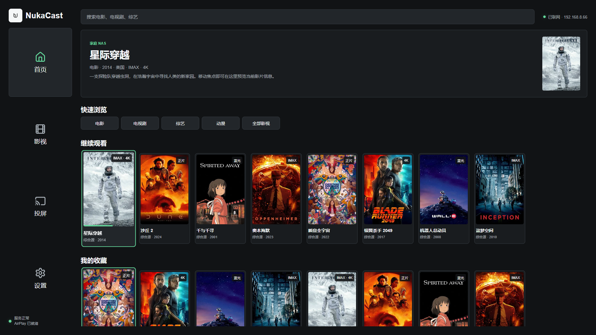
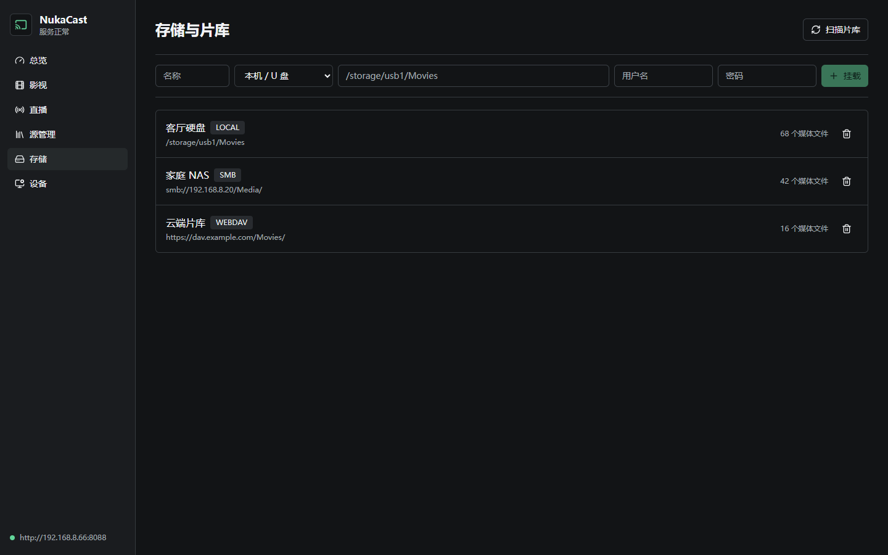

<p align="center">
  
</p>

<h1 align="center">NukaCast</h1>

<p align="center">
  面向 Android 4.2.2 电视的 AirPlay 接收器、TVBox 聚合播放器与局域网控制台。
</p>

<p align="center">
  <a href="https://github.com/kry4r/Nuka-Cast/actions/workflows/android.yml"></a>
  
  
  <a href="LICENSE"></a>
</p>

## 主要能力

- **AirPlay 镜像接收**：发布 `_airplay._tcp` / `_raop._tcp`，完成 Legacy AirPlay、FairPlay/RAOP、H.264 和 AAC 接收，并使用低缓冲 `MediaCodec` / `AudioTrack` 渲染。
- **TVBox 影视聚合**：兼容单仓和多仓、普通 JSON、前导注释/Base64 配置、CMS、CatVod JAR Spider 与 ES Module JS Spider；支持配置解析接口、站点解析页和 WebView 媒体嗅探回退。
- **电视端浏览**：首页、影视、投屏、设置四项导航；继续观看、收藏、首页推荐、全站搜索和类型/年份/地区过滤。
- **播放体验**：详情、多个线路、选集、解析接口、HLS/DASH/普通媒体播放、断点续播与遥控器媒体键。
- **网页控制**：同一局域网内使用六位码配对，管理单仓/多仓、按仓搜索选集、控制播放器，并查看源错误、Java 闪退和 AirPlay 解码输入/输出诊断。
- **分级诊断**：电视端“设置 → 错误日志”和网页端“日志”保留最近 500 条调试、信息、警告和错误记录，可按级别筛选或清空。
- **存储与片库**：从网页挂载本机/U 盘、WebDAV 或 SMB 目录，扫描媒体文件、解析片名与剧集并合并到首页和全站搜索。
- **电视遥控器**：方向键、确定键和媒体键使用原生焦点系统，不依赖手机遥控器。

电视端不展示直播入口；底层仍保留 TVBox 直播字段解析，以免读取含直播配置的接口时失败。

## 安装与使用

1. 从 [Releases](https://github.com/kry4r/Nuka-Cast/releases) 下载 APK，复制到 U 盘。
2. 在电视上允许“未知来源”，打开文件管理器安装 APK。
3. 确保电视、iPhone 或 Mac 连接到同一子网。
4. iPhone/Mac 打开屏幕镜像并选择 `NukaCast`。
5. 网页控制地址和六位配对码位于电视端“投屏”页，默认端口为 `9978`。

应用不再内置或自动恢复任何配置源。请打开电视“投屏”页显示的网页控制地址，输入六位配对码后进入“源管理”，填写从接口发布页取得的实际 `http(s)` TVBox 配置地址（不是发布页本身）进行添加、删除或刷新。多仓目录加载后会自动同步子仓；搜索默认选择最近可用且响应最快的仓。Android 4.4 会显式启用 TLS 1.2，所有应用网络与 AirPlay 媒体套接字只使用 IPv4。

电视端搜索已改为独立页面，提供 A-Z、0-9、退格、清空与搜索键；输入首字母组合后会自动搜索当前最快的健康仓。

## 电视界面

首屏针对 1080p 电视和红外遥控器设计：左侧四个等高导航区铺满可用高度，顶部只保留全站搜索与网络状态；内容区使用焦点联动精选区和横向内容轨道，按“快速浏览、继续观看、我的收藏、最近更新”排列。空的历史或收藏行会自动隐藏。

海报卡保持固定尺寸，聚焦时以 150ms 动画轻微抬升并更新精选内容，不会推挤周围卡片。旧电视上不启用实时模糊、自动预告片和复杂过渡动画；设置页可在深色与浅色主题间切换。

<p align="center">
  
</p>

## 存储与片库

网页控制端的“存储”页面可添加本机/U 盘路径、WebDAV 地址或 SMB 共享。扫描完成后，本地媒体会进入电视首页、影视筛选、全站搜索、详情与播放流程。

<p align="center">
  
</p>

文件名支持 `S02E03`、`第 3 集`、年份与常见清晰度/编码标签解析；同目录的同名海报、`poster.jpg` 或 `folder.jpg` 会作为封面。API 17 无现代 Keystore 能力，挂载账号密码保存在应用私有数据中，不会通过管理接口返回。

## 本地构建

需要 JDK 17、Android Platform/Build Tools 35、CMake 3.22.1、NDK `20.1.5948944` 和 Node.js 20。

```powershell
$env:JAVA_HOME=(Resolve-Path '.toolchains\jdk17').Path
$env:ANDROID_SDK_ROOT=(Resolve-Path '.toolchains\android-sdk').Path

Set-Location web
npm ci
npm run build
Set-Location ..

.\gradlew.bat :app:testDebugUnitTest :app:lintDebug :app:assembleDebug
```

输出文件：`app/build/outputs/apk/debug/app-debug.apk`。

## CI 与自动发版

`Android CI` 会在主分支和 Pull Request 上构建网页、运行关键单测与 Lint、编译原生 AirPlay 库，并检查 APK 的 `minSdk 17`、`armeabi-v7a` 和内嵌网页资源。

正式发版前，在仓库 `Settings > Secrets and variables > Actions` 配置：

| Secret | 内容 |
| --- | --- |
| `NUKACAST_KEYSTORE_BASE64` | Release keystore 的 Base64 内容 |
| `NUKACAST_KEYSTORE_PASSWORD` | keystore 密码 |
| `NUKACAST_KEY_ALIAS` | 签名别名 |
| `NUKACAST_KEY_PASSWORD` | 私钥密码 |

推送标签即可自动创建带 SHA-256 校验文件的 GitHub Release：

```bash
git tag v0.3.4
git push origin v0.3.4
```

## 兼容边界

- APK 最低版本为 Android 4.2.2 / API 17，正式包提供 `armeabi-v7a` 和 `arm64-v8a`。
- QuickJS 上游声明 `minSdk 18`；项目进行了 API 17 清单覆盖，仍需在目标电视验证原生库加载。
- SMB 当前由 jcifs-ng 提供 SMB2/SMB3 支持，并在首次 SMB 操作时才初始化。
- AirPlay 协议核心基于 Legacy AirPlay。iOS 26/macOS 26 的兼容性必须使用真实设备验证。
- DRM 内容（例如 Apple TV+、Netflix 的受保护视频）不保证能够镜像或播放。
- `<15 ms` 是队列设计目标，不是未经实测的承诺；最终延迟取决于电视解码器、Wi-Fi 与发送设备。

## 开源与内容说明

NukaCast 使用 GPLv3 发布。第三方组件与引入源码的许可证见 [THIRD_PARTY_NOTICES.md](THIRD_PARTY_NOTICES.md)。

项目本身不提供、不托管影视内容。用户添加的 TVBox 配置、Spider、解析接口和媒体地址应由用户自行确认授权及合规性。
